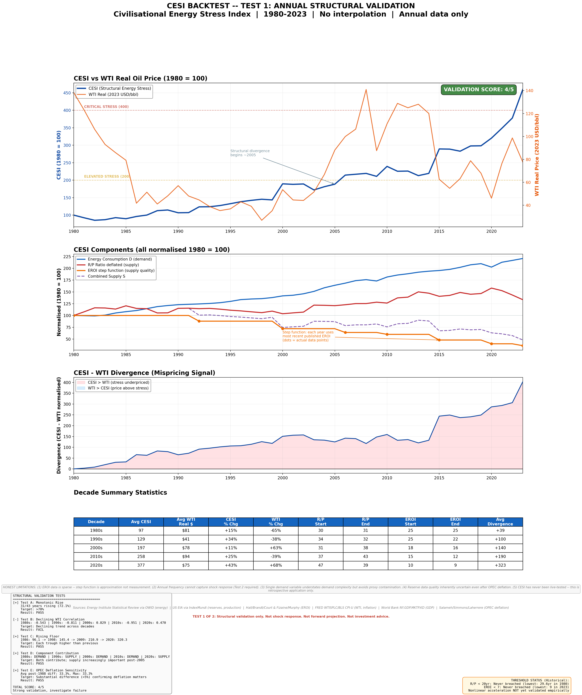

# Energy Stress Index (CESI)


CESI (Civilisational Energy Stress Index) is a framework that separates long-run energy constraint into three components: EROI, reserves-to-production, and demand. Designed for mechanism analysis—not prediction.

## TL;DR

- CESI decomposes long-run energy constraint into EROI, reserves, and demand.
- EROI decline accounts for roughly **88%** of the projected 2024–2050 stress rise.
- The framework is for mechanism insight, not forecasting.

## Why this matters

The usual debate about long-run energy is framed as *how much oil is left*. CESI reframes it as *how much energy must be spent to get the next unit of energy out*. That shift, from resource scarcity to extraction efficiency, changes which mechanism looks binding and changes what a useful policy question looks like. **It shifts the constraint from availability to efficiency, changing which risks matter and when they bind.**

<p align="center">
  
</p>

## Results at a glance

> **Key takeaway.** EROI decline explains approximately **88%** of the projected long-run constraint increase.

| | |
|---|---|
| CESI, 1980 → 2023 | 100 → 612 (6.1×, CAGR 4.3%) |
| Civilisational EROI, 1980 → 2023 | ~25:1 → ~9:1 |
| R1 robustness pass rate | 97.7% (86 of 88 runs) |
| Path correlation, CESI vs primary energy (log) | +0.98 |
| EROI-attributed share of projected 2024–2050 rise | ~88% |
| Year Central scenario exits historical envelope | ~2030–2032 |

## Headline result

Under baseline assumptions, declining EROI accounts for approximately **88%** of the projected 2024–2050 rise in CESI. Demand growth contributes roughly 56%, and reserve dynamics contribute negligibly. The attribution is conditional on the supply construction specified in the paper. The result is robust across 88 parameter-sensitivity runs (97.7% pass rate) and three structural variants including a per-capita reformulation.

## What this is not

- **Not a forecasting model.** Past ~2035 under non-benign scenarios, CESI exits the 1980–2023 envelope and is reported as a regime label, not a point estimate.
- **Not a tradable signal.** |ρ| < 0.12 against WTI, energy equities, gold, and S&P 500 across all monthly leads and lags (Section 8).
- **Not a statistically superior predictor.** Primary energy and labour productivity match or beat CESI on standard fit criteria. The contribution is mechanism *separability*, not prediction (Section 11).

## Repository layout

| Path | Contents |
|---|---|
| `paper/`     | Manuscript (Markdown + DOCX) and rendered figures |
| `src/`       | Analysis code, grouped by purpose |
| `data/`      | Raw and processed inputs with source manifest |
| `results/`   | Generated figures, tables, and output CSVs |
| `notebooks/` | Walkthrough notebook |
| `tests/`     | Smoke tests on the core index |

## Setup

```bash
git clone https://github.com/nayaladitya/energy-stress-index.git
cd energy-stress-index
python -m venv .venv
source .venv/bin/activate              # Windows: .venv\Scripts\activate
pip install -r requirements.txt
```

Python 3.11 or later.

## Reproducibility

All figures and tables in the paper are produced by the scripts in `src/`. To reproduce the full suite run them in order:

```bash
python src/backtest/cesi_backtest.py
python src/robustness/cesi_robustness_R1.py
python src/robustness/cesi_robustness_R2.py
python src/validation/cesi_test2_shock.py
python src/validation/cesi_test3_leadlag.py
python src/validation/cesi_test4_realeconomy.py
python src/validation/cesi_R4_pressure_test.py
python src/validation/cesi_R5_meaning_test.py
python src/projection/cesi_R3_projection.py
python src/projection/cesi_R3b_regime_mapping.py
```

Outputs are written to `results/`. Random seeds are fixed where stochastic steps exist, so repeated runs are bit-identical.

## Limitations

- **EROI series uncertainty.** The civilisational-scale EROI step function (25 → 22 → 18 → 16 → 15 → 12 → 10 → 9) is drawn from the published literature (Cleveland 2005; Hall et al. 2009; Murphy & Hall 2010; Lambert et al. 2014) and carries methodological uncertainty not reflected in the headline numerics.
- **Threshold choices.** The supply-side thresholds (R/P = 20 years, EROI = 7) are model choices, not physical identities. Perturbing the EROI threshold from 7 to 5 or 9 materially changes the projected supply-side penalty.
- **Time-trend confounding.** CESI carries monotonic trend information that partial-correlation controls (global GDP, US M2) do not fully remove. A portion of its raw co-movement with stress indicators is attributable to shared trend rather than to causal linkage.
- **Out-of-envelope behaviour.** Projections past approximately 2035 under any non-benign scenario lie outside the 1980–2023 operating envelope. The paper reports these as regime labels rather than point estimates.

Four explicit falsification conditions (F1–F4) are listed in Section 14 of the paper.

## Citation

See `CITATION.cff`. If you use this framework, please cite the paper and the release tag you used.

## Licence

- Code: MIT, see `LICENSE`
- Paper and figures: CC-BY-4.0
